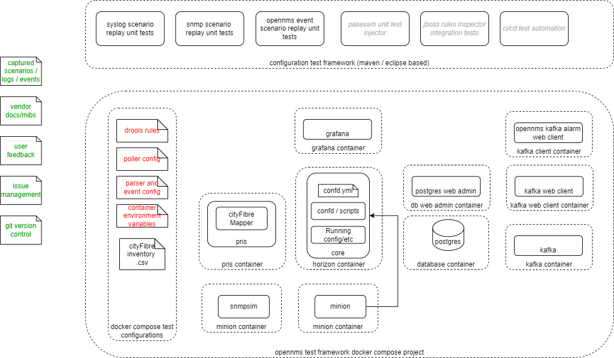

# configuration development and testing environment

This diagram illustrates the test environment used to create parsing configurations and rules and test scenarios

# overall deployment process

THis diagram illustrates a workflow for configuration managment across multiple production OpenNMS systems.

For discussion of overlays of configuration see https://github.com/opennms-forge/gitops-opennms