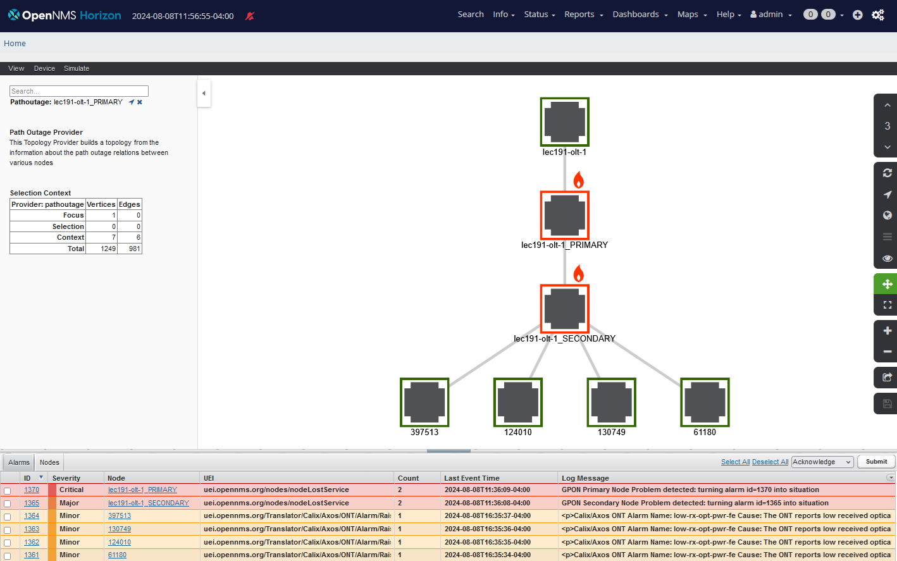

# GPON Correlation scenario currently implemented

# scenario overview


A NOC needs to be informed immediately of problems which are SLA impacting and which they can take actions to remedy. 
However in a major event, the network can produce far too much fault information for operators to analyse manually. 
Automated assistance is required to help diagnose the underlying problem quickly and reduce the visual noise of a 'storm' of sympathetic alarms.

Alarm and event correlation is a process by which a network management system seeks to present users with useful and actionable information from all of the sources of information available to it.

1. reduce the events to a set of alarms which represent the current state of problems in the network
2. create new alarms (or situations) for scenarios where the underlying pattern of alarms point to a specific problem

Scenario:

A GPON fibre network is an access network essentially organised in a tree topology.

At the head-end an OLT (optical line termination) sends multiplexed light signals to multiple  ONT (optical Network termination) consumer units.

OLT devices typically host many OLT's and are themselves connected to an edge router which feeds into the core network. 

ONT's are situated on customer premises and are variously subject to accidental disconnection, power outages or other failures local to the customer. 

ONT alarms need to be recorded and processed by the service management team as they affect the SLA with a customer and may also be required to be reported to the regulator. 
Individual ONT alarms are typically ignored by the NOC as there can be many thousands of them at any one time and they do not necessarily indicate a network wide problem. 
However a pattern of multiple ONT alarms may point to a fibre or OLT problem further up the GPON tree.

Between the ONTs and an OLT are geographically dispersed passive optical splitters which fan out the head-end fibre to each of the ONT's. 
Cityfibre refers to head-end as a  FEX (fibre exchange) and the splitters are arranged in a two tier architecture of PRIMARY and SECONDARY nodes fanning out from the FEX. 
Typically an OLT is connected to one PRIMARY node which fans out to eight SECONDARY nodes which in turn fan out to eight ONTs. 

If a fault happens in a fibre feeding a PRIMARY or SECONDARY node, it will affect communications with all of the OLT's below that point.
This can generate a sea of alarms but the NOC needs to be able to quickly identify where a fibre cut may have happened and ignore the sympathetic alarms it may have created.

The FEX, PRIMARY and SECONDARY nodes may also internally be arranged in a hierarchy of shelves and connectors. 
It is possible that an engineer working on a node may disrupt one of these internal splitters which will cause a fault for some customers but not the entire node.

Fibre cuts will cause a major outages but degradation to the signal path may also create intermittent low signal levels or high bit error rates. 
These sorts of issues need to be detected as they may precede a major problem but should be addressed through regular maintenance and are not necessarily priority problems for the NOC.

Alarms in the access network are typically concerned only with the local GPON and usually propagate sympathetic alarms into the core.
Thus the alarm management of each FEX region can be essentially stand alone from the management of the core.

## required correlation

1. record and correctly associate alarms with affected OLT's and ONT's in such a way is it is possible for later reports to be created on service impact for individual customers

2. record but do not bring to the NOC's attention alarms on individual ONT's

3. record for later reporting alarms where an intermittent problem or degradation may be occurring but which is not currently a major outage.

4. correlate critical ONT alarms across the GPON topology to quickly detect the location of major fibre outages.

## critical alarms and alarm parsing


critical alarms which indicate a fibre break are any of the following

|CALEX | ont-eth-down,ont-dying-gasp,ont-missing,low-rx-opt-pwr-fe,loss-of-pon,lacp-fault-on-port,lag-group-down,duplex-system-failure,card-departed,lan-los|

|NOKIA |onu-dying-gasp,onu-loss-of-phy-layer,transceiver-link-rx-power|

More detailed breakdown (Simon Mc Bride 28 Jun 2024, 15:59)

|Error Condition                           |OLT alarm                   | PE Alarm               |Notes                               |
|------------------------------------------|----------------------------|------------------------|------------------------------------|
|Customer ONT Ethernet Port state change   | ont-eth-down / lan-los     | CFM defMACstatus       |                                    |
|Power loss at ONT                         |  ont-dying-gasp / ont departed / onu-dying-gasp | CFM defRemoteCCM    |                  |
|Fibre break beween ONT and OLT            | ont-missing / onu-loss-of-phy-layer | CFM defRemoteCCM  |  Can be at any point between customer premisis and OLT including Primary or Secondary Node in which case multiple customers might be impacted |
|Fibre break between Primary Node and OLT  |   loss-of-pon | CFM defRemoteCCM   | Might also receive this message if a PON only has a single customer and that customer experiences a fibre break |
|Bent fibre between ONT and OLT            | low-rx-opt-pwr-fe / low-rx-opt-pwr-ne / transceiver-link-rx-power |   | Can be at any point between customer premises and OLT including Primary or Secondary Node in which case multiple customers might be impacted |
|Failure of PON Optic                      |  interface-module-failure  |   CFM defRemoteCCM     |              |
|Failure of OLT linecard                   |card-departed               |  CFM defRemoteCCM      |          |
|Failure of  single link in bundle interface between OLT and PE|  lacp-fault-on-port | n/a |
|Failure of bundle interface between OLT and PE | lag-group-down        | CFM defRemoteCCM   |  |
            

## solution 

The figure below illustrates the event flow and correlation within OpenNMS.


### 1. inventory
A correct inventory and network model is critical to any correlation. 
OpenNMS can model tree networks using the parent node feature. 
Within OpenNMS we represent ONTs, LTE's, PRIMARY NODES, SECODNARY NODES and connected PE routers.
Each node is created with a link to it's parent node. 
We also populate the asset table for each node with the devices serial number and asset number which are used as the key within LTE events to associate alarms to the correct OLT.

The Provisioning Integration Server (PRIS) is used to create the provisioning requisitions from a CSV file provided by the customer. 
An extra translator process for pris is used to map the customer csv to the OpenNMS requisition including the parent relationships needed for the model.

This allows us to visualise the GPON hierarchy as shown below.



### 2. parsing events and syslogs

Nokia and Calix GPON devices use Syslog to report alarms. 
The format of the syslogs and content of messages from both devices differ significantly. 
The first stage of the process is to correctly parse these messages into useful OpenNMS Events

### 3. creating new alarms for ONTs

The customer located ONT's do not generate any alarms directly but instead rely on problems being reported by their parent  OLT. 
The event translator is used to parse the ONT identifiers (Asset or Serial numbers) from OLT events and do a database look up to find which Node in OpenNMS to associate the alarm with. 
This process is performed in the event-translator.


### 4. finding related alarms

OpenNMS has the concept of a Situation which is an alarm that wraps other alarms and represents a collection of sympathetic alarms around a network event. The following image illustrates
how situations are included in an alarm list. 


A Situation is illustrated below.
Note that a Situation is an alarm with associated alarms (which can also be situations).
In this case all four ONT's below lec191-olt-secondary have low-rx-opt-pwf-fe alarms.


To discover a situation, we need to use the topology model to relate alarms and discover whether all of the OLT's below a network splitter have critical alarms. 
If all of the ONT's have a critical alarm, then we know that there is probably a problem with the fibre above the splitter

If all of the ONT's below a SECONDARY NODE have any one of the critical alarms described above, we create a situation.

### Situation detection using JDBC poller

We use database scanning using the JDBC service poller to run sql queries repeatedly every minute to find these situations. 
If a situation is found a service down alarm is created for the passive splitter.

The image below shows the jdbc poller service passive-secondary-node running for lec191-olt-1_SECONDARY


The effective query is shown in the poller service parameters and is superficially quite complex

It is broken down below

```
WITH 
    parent_id_query AS (SELECT n.nodeid AS parentId FROM node n WHERE n.foreignsource='gpon3' AND n.foreignid='lec191-olt-1_SECONDARY' ), 

    child_count_query AS (SELECT COUNT(*) AS childCount FROM node n WHERE n.nodeparentid IN (SELECT parentId FROM parent_id_query) ),

    distinct_alarm_count_query AS (SELECT COUNT(*) AS distinctAlarmCount FROM ( 
        SELECT DISTINCT al.nodeid FROM alarms al INNER JOIN 
        string_to_table('ont-eth-down,ont-dying-gasp,ont-missing,low-rx-opt-pwr-fe,loss-of-pon,lacp-fault-on-port,lag-group-down,duplex-system-failure,card-departed,lan-los,onu-dying-gasp,onu-loss-of-phy-layer,transceiver-link-rx-power', ',') 
        AS t(name) ON al.reductionkey LIKE CONCAT( '%:',name) 

        WHERE al.severity>3 AND al.nodeid IN (SELECT n.nodeid FROM node n WHERE n.nodeparentid IN (SELECT parentId FROM parent_id_query)) 
        ) AS tempTable ) 

SELECT (CASE WHEN childCount=0 THEN 0 WHEN distinctAlarmCount>= childCount THEN 1 ELSE 0 END) AS serviceDown, childCount, distinctAlarmCount FROM child_count_query, distinct_alarm_count_query 
```

For a service to be down, a JDBC poller query must return a single row with a column serviceDown = 1 if a problem is detected and serviceDown = 0 if there is no problem.

Starting with the last SELECT statement, we can see that a serviceDown=1 is generated if distinctAlarmCount is greater or equal to the childCount

The childCount is the number of ONT nodes which have the lec191-olt-1_SECONDARY node as their parent node.

The distinctAlarmCount is the number of child nodes with one or more critical alarms.

If the distinctAlarmCount is equal to the number of child ONT nodes, then all the OLT's connected to the secondary node have a critical problem and so the fibre between the secondary node and the primary node is probably cut.

Three sub queries are defined in a WITH statement to get this result.

parent_id_query finds all the primary keys for all the nodes (OLTs) which have lec191-olt-1_SECONDARY as their parent

child_count_query uses the parent_id_query to count the number of children which have lec191-olt-1_SECONDARY as their parent

distinct_alarm_count_query looks for all the nodes found from the parent_id_query which have one or more critical alarm(s).

The alarm type is determined by the last segment of the alarm reduction key 

for instance in alarm 1364, the reduction key is `uei.opennms.org/Translator/Calix/Axos/ONT/Alarm/Raise::867:low-rx-opt-pwr-fe`

The distinctAlarmCount has a constant name table which defines the names of all of the possible alarm types we care about (and which can be changed to match new alarms).

This contains low-rx-opt-pwr-fe and so the query will match alarm 1364

So the query is looking for alarms with severity>3 ( i.e. not cleared) and alarm type in the names table and the node is a child of the lec191-olt-1_SECONDARY

Thus the  distinct_alarm_count_query counts each node for which one or more critical alarm match is found.


# situation creation using Drools rules

We use Drools rules to create the situation from the service down events detected using the database query above.

the Drools rule looks for service down alarms on each splitter and then looks for all alarms below the splitter to associate into a situation.

It does not itself detect the situation but gathers all of the alarms below a splitter node where a situation is suspected.


