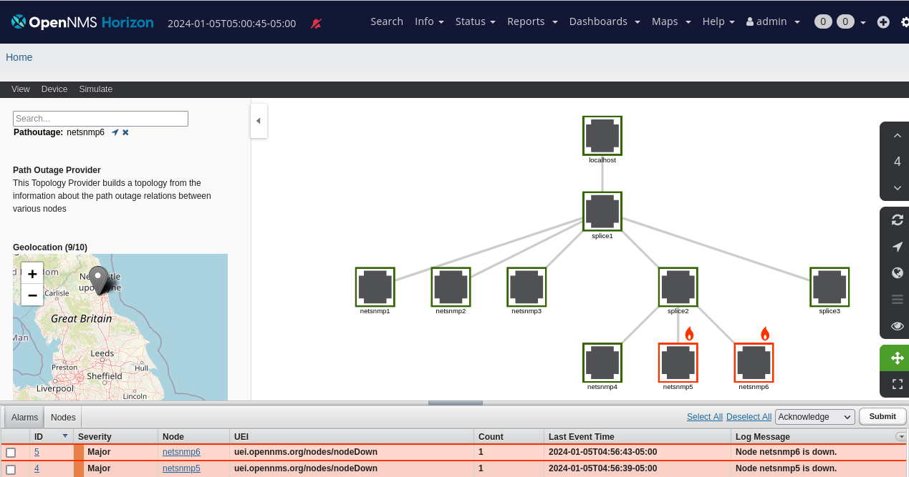

# Representing gpon in OpenNMS

## introduction and use case

This example comes from a use case inspired by GPON networks. 

It uses the OpenNMS Path Outage Topology provider to represent a passive GPON fibre network consisting of CPE's connected to the OLT through a tree of spice points.
The splice points are represented using un-managed nodes in OpenNMS but the active elements are represented using managed nodes. 

The provisioning requisition allows nodes to be defined with their parent nodes and this gives rise to the topology tree. 



OpenNMS can use this configuration to suppress down stream outages when a parent has an outage but in this case we do not want to suppress alarms but help users see the relationship between nodes which have alarms in a passive optical network which could not be discovered using LLDP.

The next step will be to design drools rules which use this topology to create alarms which indicate the location of a possible fibre cut. 
The assumption is that the CPE's will be regularly polled or by some means we will be informed that a CPE is not in service.

The rules would then be designed to follow logic based on 

1. If a single or several (but not all) CPE's below a splice are down this indicates a fault at the consumer end.
2. If all CPE's below a splice are down, this indicates that the parent fibre feeding the splice is possibly cut.
3. If all CPE's below an OLT are down, then there is a problem with the OLT or the fibre coming from the OLT.

(ALEC could also be applied to this topology model to learn more subtle relationships between alarms on devices but this will need investigation and may not yield the same results as using simple rules). 

## Proof of concept

In this proof of concept, we have used docker compose to create a network and a full OpenNMS stack with simple NetSNMP containers to represent the CPE's. 

The example uses [The openNMS Provisioning Integration Server PRIS](https://docs.opennms.com/pris/2.0.0/index.html) to create a complex provisioning requisition from an excel spreadsheet.

Some example events are provided in the rester-export-postman.json file which can be imported into a RESTer plugin to make importing requisitions easier in this example.

( see [RESTer plugin For Chrome](https://chromewebstore.google.com/detail/rester/eejfoncpjfgmeleakejdcanedmefagga) or 
[RESTer plugin For Firefox](https://addons.mozilla.org/en-GB/firefox/addon/rester/) )

### Importing Requisition from PRIS

An event can be sent to OpenNMS to request that it imports a requisition from an external URL.

See [OpenNMS import provisioning to OpenNMS](https://docs.opennms.com/pris/2.0.0/provision-to-opennms.html)

[PRIS](https://docs.opennms.com/pris/2.0.0/index.html) is used as source of data to generate this requisition from an excel spreadsheet gpon1.xls.

A docker image for PRIS is used to run the PRIS service. 

You can see the requisiton by pointing a browser at http://localhost:8000/requisitions/gpon1  but within the docker network, the requisition is found at http://pris:8000/requisitions/gpon1

To tell OpenNMS to import PRIS use the following event (change address as necessary)

POST http://localhost:8980/opennms/rest/events

Content-Type Application/xml

Accept Application/xml

```
<event><uei>uei.opennms.org/internal/importer/reloadImport</uei>
     <parms><parm>
         <parmName>url</parmName><value>http://pris:8000/requisitions/gpon1</value>
     </parm></parms> 
</event>
```

